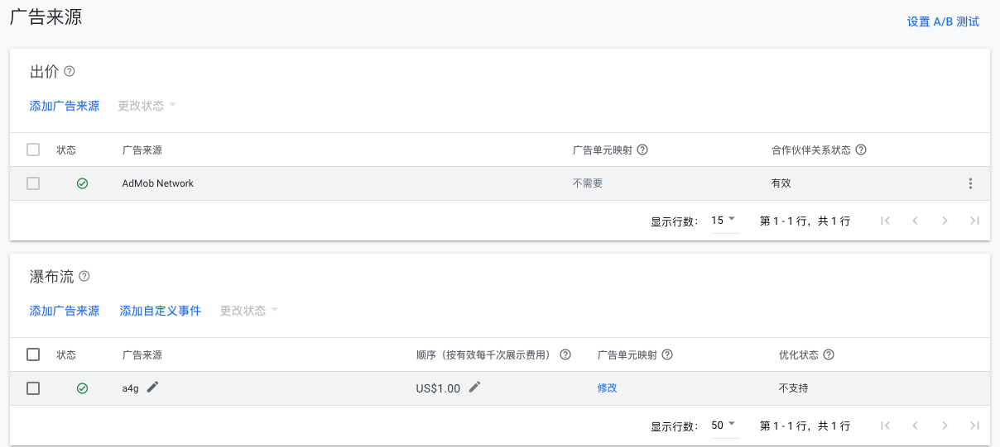
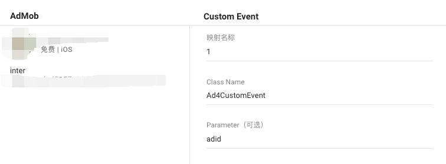

# admob-adapter

**Features**

 Banner / Interstitial / Rewarded
 
 
**Requirements**

iOS 10.0+

GoogleMobileAds 10.0+

**Installation**

CocoaPods

pod 'Ad4AdmobMediation',:git =>'https://github.com/Ad4GameTech/admob-adapter-ios.git','1.1.1'

**Configure mediation settings for your AdMob ad unit**
You need to add Ad4Game placements provided by the Ad4Game team to the mediation configuration as waterfall ad source for your ad unit.

Custom Event screen parameters

Class Name : Ad4CustomEvent

Parameter : Ad4Game Unit ID

